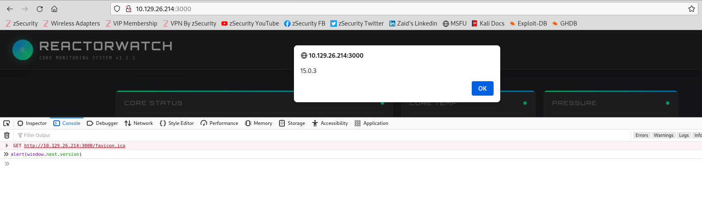

## Reactor

This CTF lab activity is from the seasonal of HackTheBox

Performed nmap scanning on the target IP Address to gather information and plan the attack
flags used:
-sCV combination of -sC and -sV
  nmap default script to check for common vulnerabilities and service version
-Pn
  forces Nmap to treat the target as active and scan it anyway
-p-
  scan all port
--min-rate 5000
  send minimum of 5000 packets per second making the scan faster

 It shows port 3000 is usiing Next.js. Did some research on the CVE for next.js

Used inspect inside the webpage ip address entering the port 3000 and use an alert to show the specific version of the next.js

